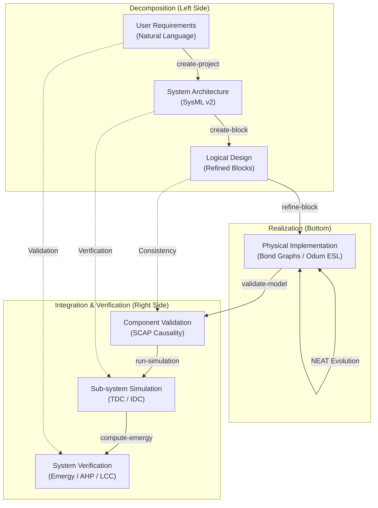

# MDK V-Model — Deterministic Systems Engineering

The **MDK V-Model** maps the classical Systems Engineering "V" onto the agentic and deterministic tools provided by the framework. It bridges the gap between high-level requirements (SysML) and low-level physical realization (Bond Graphs), ensuring bidirectional traceability and automated verification.

## 1. Requirements & System Architecture (The Top Left)
- **Tool**: `create_project`, `create_block`
- **Representation**: SysML v2 (Structural subset)
- **Action**: The LLM (Gemini) translates the user's intent into a formal decomposition of Parts and Ports. This defines the *Logical Architecture*.

## 2. Logical Design & Refinement
- **Tool**: `refine_block`
- **Action**: Each SysML block is mapped to a Bond Graph topology. This is where physical parameters (Mass, Stiffness, Resistance) are first assigned.

## 3. Physical Implementation (The Vertex)
- **Tool**: `transpile_sysml`
- **Representation**: Bond Graph Model (JSON)
- **Innovation**: The **NEAT Evolutionary Engine** (T10.1) can be used here to automatically discover optimal topologies that satisfy the performance requirements defined at the higher levels.

## 4. Component Validation (Unit Testing)
- **Tool**: `validate_model` (SCAP Algorithm)
- **Check**: Verifies physical consistency. If a model has causality conflicts (e.g., two flow sources fighting for the same junction), the "linter" catches it here before simulation.

## 5. Sub-system Simulation (Integration Testing)
- **Tool**: `run_simulation` (TDC/IDC)
- **Check**: Solves the state-space equations. We verify that the time-domain behavior (settling time, overshoot) matches the constraints derived from the System Architecture.

## 6. System Verification (The Top Right)
- **Tool**: `compute_emergy`, `generate_bom`
- **Check**: Final verification of non-functional requirements.
    - **Procurement**: Does the BOM match the budget?
    - **Sustainability**: Does the Emergy/Transformity analysis satisfy environmental constraints?
    - **Decision Support**: Does the final design satisfy the user's initial requirements?
